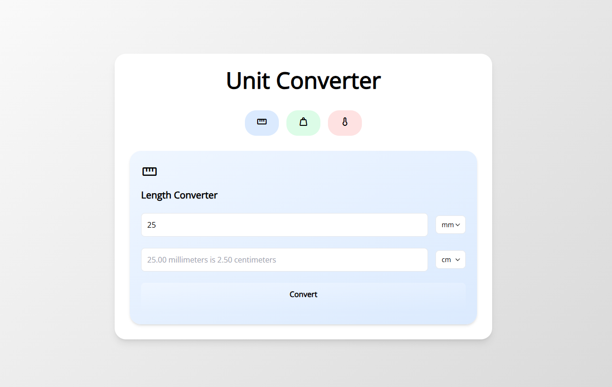
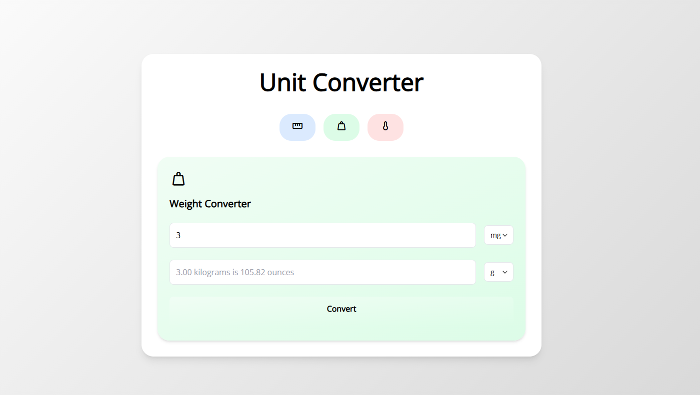
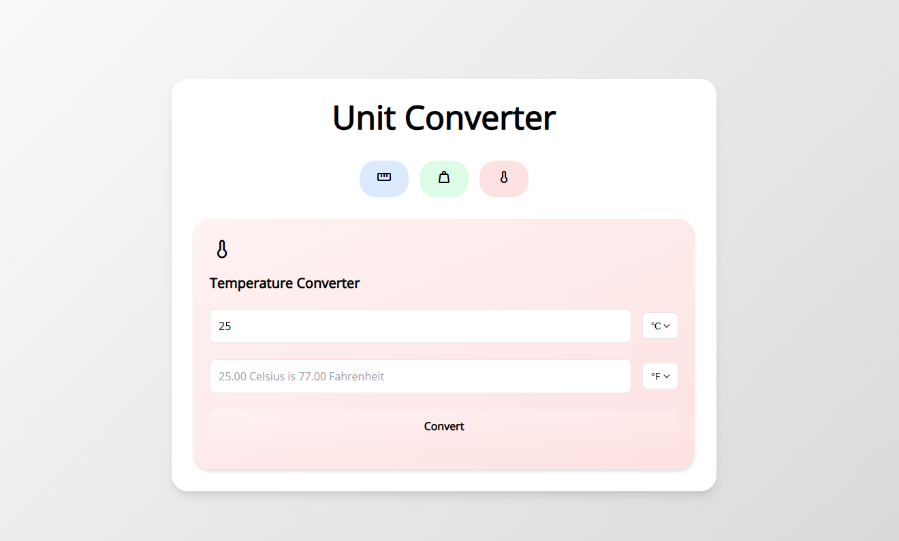

# Unit Converter

A simple yet powerful unit converter built with Go (Golang) for the backend and HTML with Tailwind CSS for the frontend. This project allows users to convert between different units of length, weight, and temperature seamlessly.

## Table of Contents 📚

- [Features](#features)
- [Project Structure](#project-structure)
- [Getting Started](#getting-started)
  - [Prerequisites](#prerequisites)
  - [Installation](#installation)
  - [Usage](#usage)
- [Backend (Go)](#backend-go)
- [Frontend (HTML + Tailwind CSS)](#frontend-html--tailwind-css)
- [Screenshots 🖼️](#screenshots-️)
- [Contributing 🤝](#contributing-)
- [License](#license)
- [Acknowledgments](#acknowledgments)

## Features

- **Length Conversion**: Convert between millimeters, centimeters, meters, kilometers, inches, feet, yards, and miles.
- **Weight Conversion**: Convert between milligrams, grams, kilograms, ounces, and pounds.
- **Temperature Conversion**: Convert between Celsius, Fahrenheit, and Kelvin.
- **User-Friendly Interface**: A clean and intuitive interface built with Tailwind CSS.
- **Responsive Design**: The interface is fully responsive and works well on all devices.

## Project Structure

unit-converter-go/  
├── frontend/  
│   ├── length.html  
│   ├── weight.html  
│   └── temperature.html  
├── server/  
│   └── server.go  
├── main.go  
└── README.md

- **frontend/**: Contains the HTML templates for the different conversion types.
- **server/**: Contains the backend logic written in Go.
- **main.go**: The entry point of the application.

## Getting Started

### Prerequisites

- Go (Golang) installed on your machine.
- A modern web browser.

### Installation

1. **Clone the repository**:
   ```bash
   git clone https://github.com/your-username/unit-converter-go.git
   cd unit-converter-go

2. **Run the Go server:**
    ```bash
    go run main.go

3. **Open your browser:**  
      Navigate to `http://localhost:8080` to access the unit converter.

### Usage

1. **Select the type of conversion**:
   - Click on the appropriate button (Length, Weight, or Temperature) to select the type of conversion you want to perform.

2. **Enter the value**:
   - Input the value you want to convert in the provided field.

3. **Select the units**:
   - Choose the unit you are converting from and the unit you are converting to from the dropdown menus.

4. **Convert**:
   - Click the "Convert" button to see the result.

## Backend (Go)

The backend is built using Go and handles the conversion logic. It serves the HTML templates and processes the conversion requests.

### Key Functions

- **StartServer()**: Initializes the HTTP server and sets up the routes.
- **lengthHandler()**, **weightHandler()**, **temperatureHandler()**: Handles the respective conversion requests.
- **convert()**: Performs the actual conversion based on the type of conversion selected.
- **renderTemplate()**: Renders the HTML templates with the conversion results.

### Example: Length Conversion Logic

```go
func convertLength(value float64, from, to string) float64 {
    convertedToMilimeters := convertToMillimeter(value, from)
    convertToNeededValue := convertMillimeterToValue(convertedToMilimeters, to)
    return convertToNeededValue
}
```

## Frontend (HTML + Tailwind CSS)

The frontend is built using HTML and styled with Tailwind CSS. It provides a responsive and user-friendly interface for the unit converter.

## Screenshots 🖼️

###  Length Converter


### Weight Converter


### Temperature Converter


## Contributing 🤝
Contributions are welcome! If you'd like to contribute to this project, please follow these steps:

1. Fork the repository.
2. Create a new branch:
    ` git checkout -b feature/YourFeatureName`
3. Commit your changes:
    `git commit -m 'Add some feature'`
4. Push to the branch:
    `git push origin feature/YourFeatureName`
5. Open a pull request.


## License
This project is licensed under the MIT License - see the [LICENSE](LICENSE) file for details.

## Acknowledgments
- Made with ❤️ by [Matvey Grachev](https://github.com/datslim).
- [Tailwind CSS](https://tailwindcss.com/) for the amazing utility-first CSS framework.
- [Go (Golang)](https://go.dev/) for the powerful and efficient backend language.
- Inspired by [roadmap website!](https://roadmap.sh/projects/unit-converter)
---

Enjoy converting units with ease! 🚀